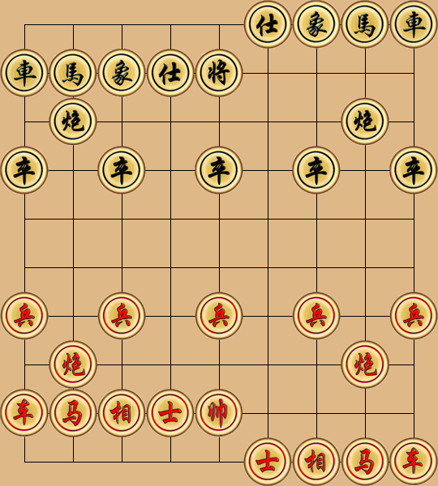

# 象棋對戰 Xiangqi Battle ♟️

🎮 點擊下方的走法連結來進行對局（使用 GitHub Issue）  
👥 所有人都可以參與，紅黑輪流走棋！

---

## ⚫️ 當前棋盤

> 棋盤圖片會隨每一步更新

---

## ✅ 開始下棋！

➡️ 點擊走法建立新 Issue，例如：  
[移動：b2 → b3](https://github.com/Asriel0727/xiangqi-battle/issues/new?title=xiangqi%7Cmove%7Cb2-b3%7Cgame001)

請根據棋局輪到哪一方來走合法的一步。
